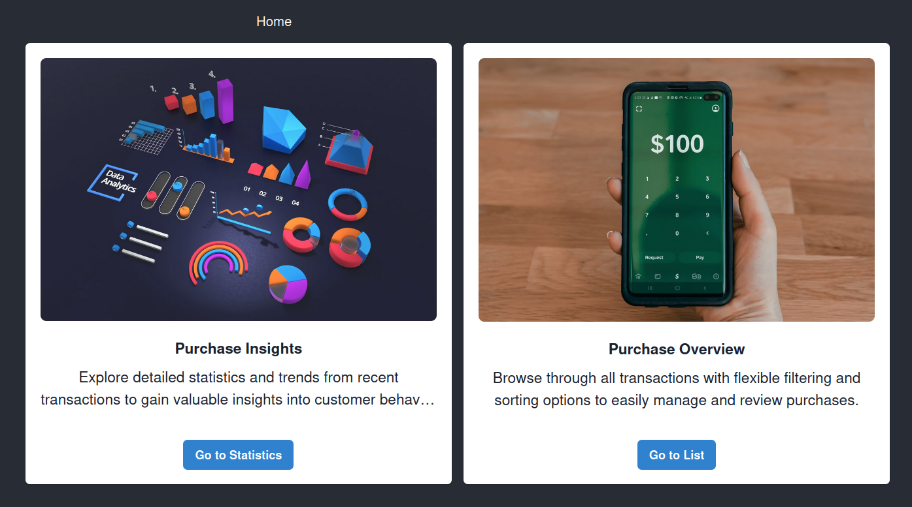
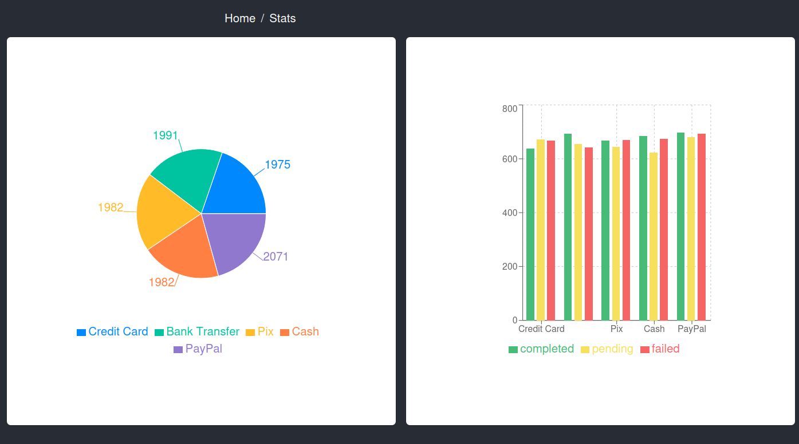
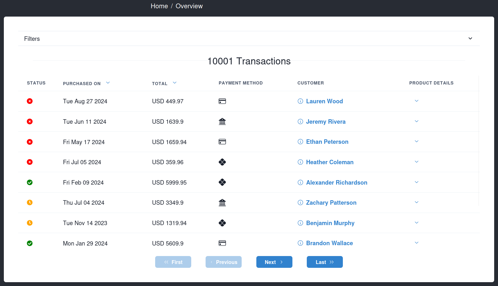
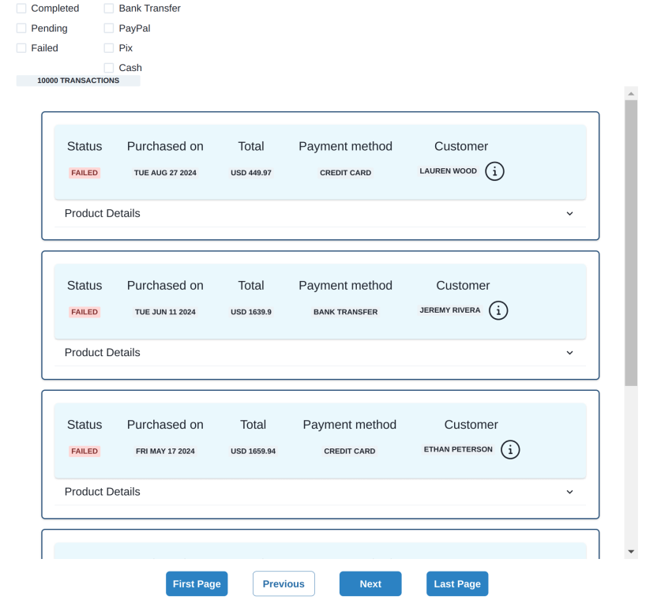

# Purchase Dashboard App

Project walkthrough!

---

## Architecture

The dashboard is basically made of three pages:

* Home
* Stats
* Overview

---

## Home

This is the landing page. Here users get an overall idea of what they can do in the application and have options to navigate to the other pages.

---

## Stats

Naturally this is the area users would go to analyze data and to get insight into trends.

---

## Overview

This is a more traditional table where users can filter and sort data.

---

## Technologies and libraries

This project was built with React and TypeScript.
It is deployed to Azure Static Web App using GitHub Actions.
Unit testing is done using Vitest.

---

### Main Features

* UX
  * Filtering
  * Sorting
  * Visualization
* DX
  * Smaller, reusable components
  * Custom hooks
  * Unit testing

---

### Challenges

* Design

* Vitest

---

### Time constraints

* Reduced filter and sorting options
* Simpler design
* No routes

---

### Improvements

* Refactoring
* More filter and sorting options
* Improved styling
* Visual identity
